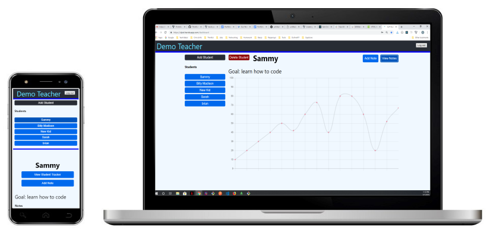

# SLP Student Tracker 

## Description:
SLP Student Tracker is an app made for Speech Language Pathologists. A SLP will use this app to keep track of students progress by recording a SOAP note after each therapy session. Once notes have been made the SLP can view progress of student by clicking the View Student Tracker button. 

## Link To App
https://slpst.herokuapp.com/

## Link To Server
  https://github.com/thinkful-ei26/sam-sst-server

## Tech Stack
React and Redux for the client. Node for the server with a MongoDB

## ScreenShots

  

